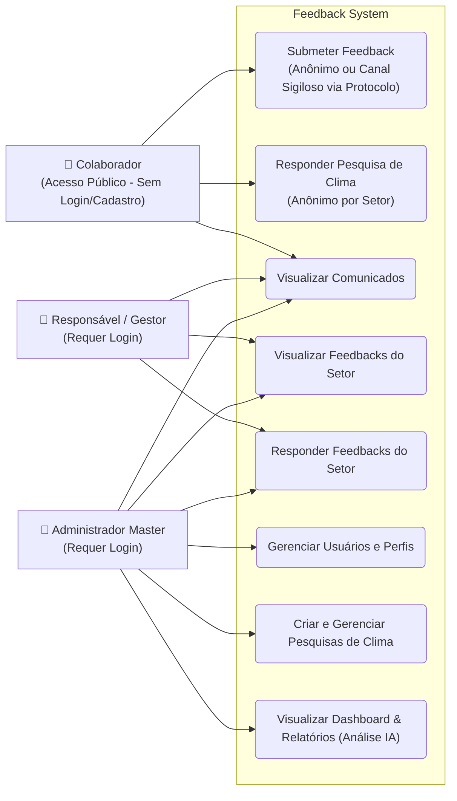
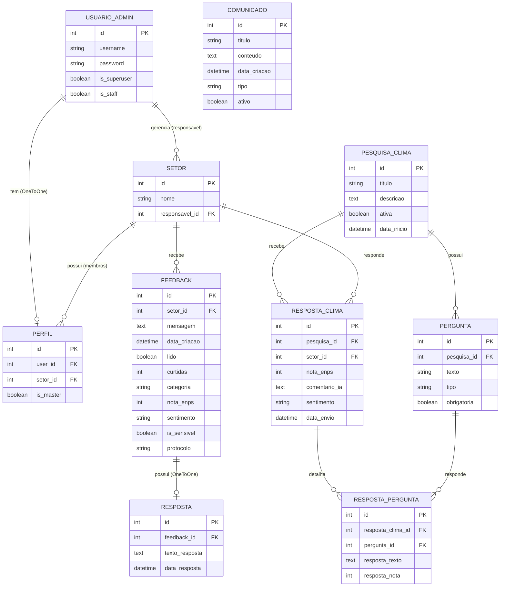
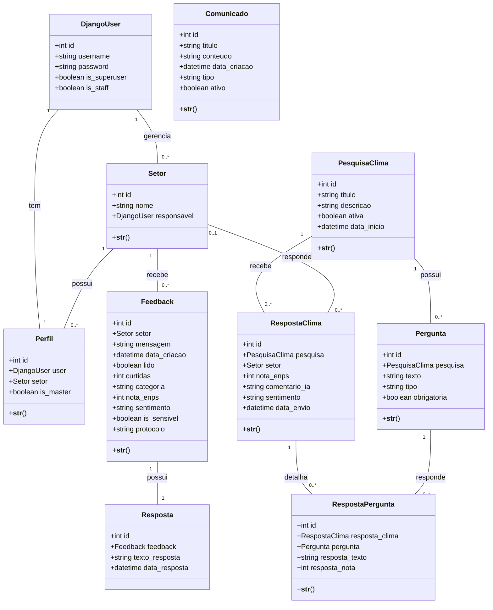

# Diagramas do Projeto - Feedback System

Este documento contém os diagramas representativos da arquitetura, dados e interações do sistema baseados na sintaxe **Mermaid**. Eles podem ser visualizados nativamente em plataformas como GitHub, Notion, Obsidian e por extensões do VS Code.

---

## 1. Diagrama de Caso de Uso

Este diagrama descreve as interações dos diferentes atores (Colaborador, Gestor e Administrador Master) com as principais funcionalidades do sistema.

---

## 2. Diagrama Entidade-Relacionamento (DER)

Representa o modelo físico do banco de dados relacional do sistema, incluindo os modelos do sistema de autenticação, perfis, feedbacks e pesquisas de clima.

> [!NOTE]
> O sistema não exige login ou cadastro para os colaboradores (que enviam feedbacks e respondem pesquisas de clima). A tabela **USUARIO_ADMIN** (que mapeia diretamente para `auth.User` do Django) armazena exclusivamente as credenciais de administradores (Master) e gestores de setores para acesso ao Dashboard administrativo.

---

## 3. Diagrama de Classes UML

Demonstra a estrutura orientada a objetos das classes de modelo (Django Models) do projeto, com seus atributos, métodos e relações estruturais.

